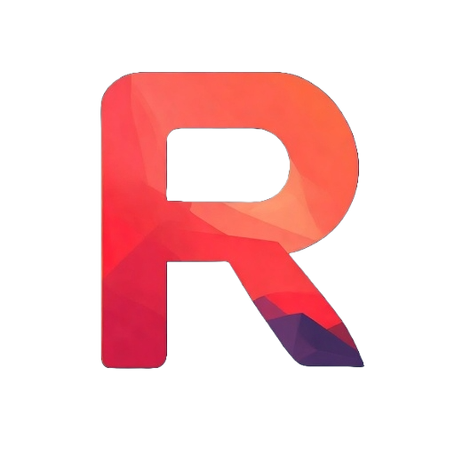

  

<h1 align="center">Revolt Ultimate</h1>

  A modern .NET program to track achievements and provide real-time updates with custom notifications from multiple platforms. Recreating the console feel of unlocking achievements.

---

## Features

- Real time achievement tracking for multiple game platforms
- Fully support Steam and GOG pirated games
- Fully support external games that had no achievements or don't even have a game platform
- Custom notifications, allowing you to customize how your achievement looks when you get it
- A cute leveling system to impress your friends on how much you didn't touch grass

## Platform Supported

(Checked means supported now, not checked means coming soon)

- [x] Steam
- [x] Steam Pirated
- [x] GOG
- [x] GOG Pirated
- [ ] Xbox
- [ ] Epic
- [ ] EA
- [ ] Windows PC Games (Games that are installed from disk)
- [ ] RetroAchievements

## Installation

Visit the official website to download the latest version:

**[https://revoltultimate.puzzlebest.tech](https://revoltultimate.puzzlebest.tech)**

Alternatively, you can download directly from the [Releases](https://github.com/ricky074game/RevoltUltimate/releases) page.

## Feedback

If you have any feedback, issues with the program, or anything else at all, please create an issue.
Your feedback and suggestions are always needed to make this program the best!

## Contributing

Contributions are always welcome! Feel free to make a pull request.

See `CONTRIBUTING.md` for ways to get started.

## License
This project is licensed under the MIT License - see the [LICENSE](LICENSE) file for details.

## Star History

